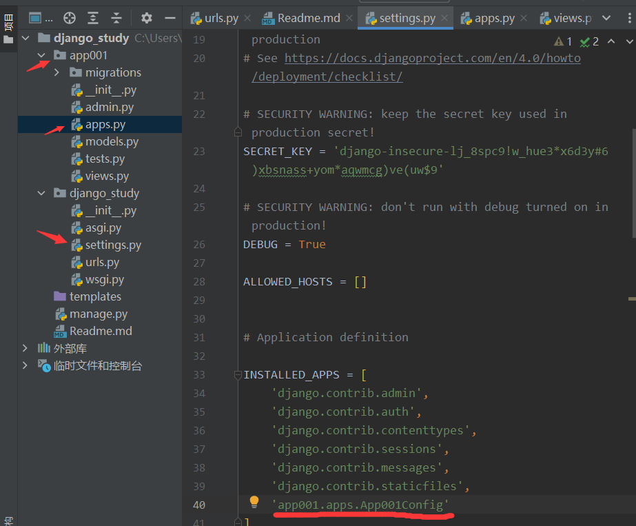
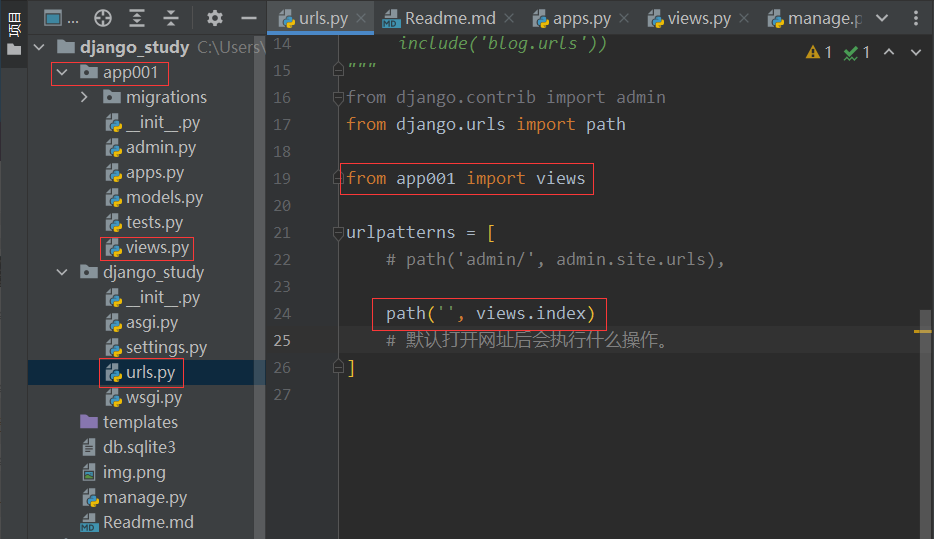
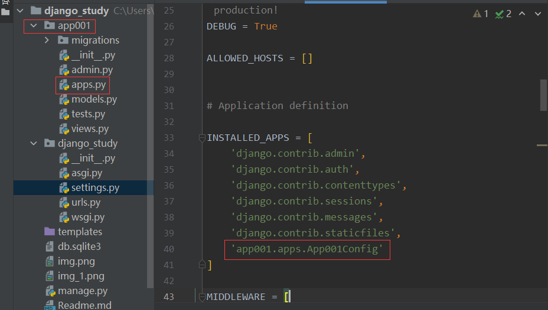
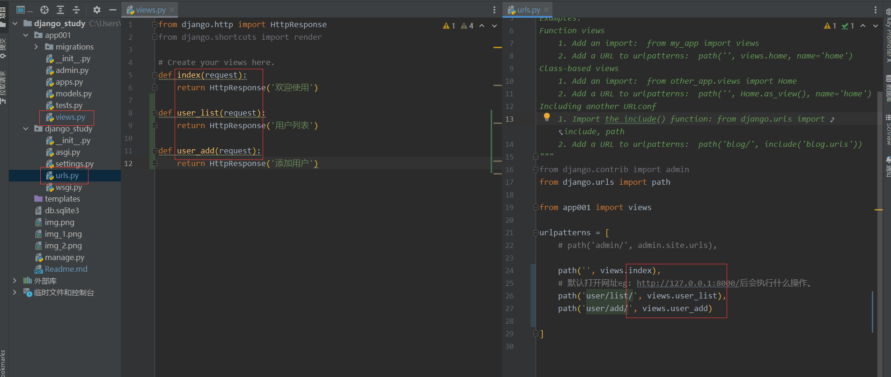

## Django Tree
```
DJANGO_STUDY
│  manage.py        [项目管理，启动创建app，不需要修改]
├─django_study      [项目名称]
│  │  asgi.py       [接受网络请求][不修改]
│  │  settings.py   [项目的配置文件]               [主要修改文件]
│  │  urls.py       [URL和Python函数的对应关系]    [主要修改文件]
│  └─ wsgi.py       [接受网络请求][不修改]
└─templates
```
## App  

- 项目(一般用不上多app，创建一个就行)
    - app1 [表结构、函数、HTML模板、CSS]
    - app2
    - app3
    - app4  

创建指令 `manage.py startapp APPNAME`

```
APP001
│  admin.py   [Django默认后台管理]
│  apps.py    [app启动类]
│  models.py  [操作数据库]           [主要操作]
│  tests.py   [单元测试]
│  views.py   [函数]                [主要操作]
```

## 快速上手

- 确保APP已注册[settings.py]
  
- 编写URL和视图函数对应关系[urls.py]  
  
- 编写视图函数 [views.py]
  
- 启动Django项目
  - 通过命令行启动 `python manage.py runserver`
  - Pycharm 右上角选择 django启动

## 创建一个新的页面
- url -> function
- views -> function
